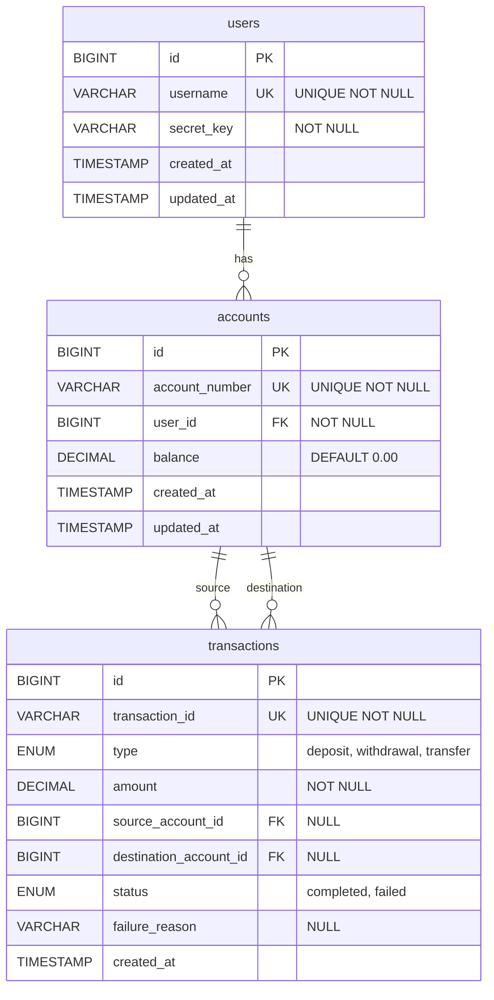

## Database Schema Design

### Entity-Relationship Model

#### Users Table
```sql
CREATE TABLE users (
    id BIGINT PRIMARY KEY AUTO_INCREMENT,
    username VARCHAR(50) UNIQUE NOT NULL,
    secret_key VARCHAR(255) NOT NULL,
    created_at TIMESTAMP DEFAULT CURRENT_TIMESTAMP,
    updated_at TIMESTAMP DEFAULT CURRENT_TIMESTAMP ON UPDATE CURRENT_TIMESTAMP
)
```

---

#### Accounts Table
```sql
CREATE TABLE accounts (
    id BIGINT PRIMARY KEY AUTO_INCREMENT,
    account_number VARCHAR(20) UNIQUE NOT NULL,
    user_id BIGINT NOT NULL,
    balance DECIMAL(15,2) NOT NULL DEFAULT 0.00,
    created_at TIMESTAMP DEFAULT CURRENT_TIMESTAMP,
    updated_at TIMESTAMP DEFAULT CURRENT_TIMESTAMP ON UPDATE CURRENT_TIMESTAMP,
    
    FOREIGN KEY (user_id) REFERENCES users(id) ON DELETE CASCADE,
    CONSTRAINT chk_balance_non_negative CHECK (balance >= 0)
)
```

---

#### Transactions Table
```sql
CREATE TABLE transactions (
    id BIGINT PRIMARY KEY AUTO_INCREMENT,
    transaction_id VARCHAR(36) UNIQUE NOT NULL,
    type ENUM('deposit', 'withdrawal', 'transfer') NOT NULL,
    amount DECIMAL(15,2) NOT NULL,
    source_account_id BIGINT NULL,
    destination_account_id BIGINT NULL,
    status ENUM('completed', 'failed') NOT NULL,
    failure_reason VARCHAR(255) NULL,
    created_at TIMESTAMP DEFAULT CURRENT_TIMESTAMP
)
```



---

## API Design

### RESTful Principles

**Decision:** Follow REST conventions with resource-based URLs.

**Endpoints:**
```
POST   /api/transactions          # Submit transaction
GET    /api/accounts/:accountId   # Get account balance
GET    /api/reports/summary        # Get summary report
```

---

### Authentication

**Decision:** Use header-based API key authentication (`X-Secret-Key`).

**Implementation:**
```typescript
// Middleware checks X-Secret-Key header
export const authenticateUser = async (req, res, next) => {
  const secretKey = req.headers["x-secret-key"];
  const user = await UserService.findBySecretKey(secretKey);
  // ...
}
```

**Reasoning:**
- **Stateless:** No session management needed
- **Simple:** Easy to implement and test
- **Standard:** Common pattern for internal APIs
- **Secure Enough:** For a take-home assignment (production would use OAuth2/JWT)

**Alternatives Considered:**
- JWT tokens: Over-engineering for this scope
- Basic Auth: Less flexible for API keys

---

### Request Validation

**Decision:** Use Joi for schema validation middleware.

**Example:**
```typescript
const transactionSchema = Joi.object({
  type: Joi.string().valid('deposit', 'withdrawal', 'transfer').required(),
  amount: Joi.number().required(),
  source_account_id: Joi.when('type', {
    is: Joi.string().valid('withdrawal', 'transfer'),
    then: Joi.required(),
    otherwise: Joi.forbidden()
  })
})
```

**Reasoning:**
- **Declarative:** Schema is self-documenting
- **Conditional Validation:** Different fields required based on transaction type
- **Early Failure:** Invalid requests rejected before hitting business logic
- **Better Error Messages:** Joi provides detailed validation errors

---

### Error Handling

**Decision:** Centralized error handling with custom `AppError` class.

**Implementation:**
```typescript
// Custom error class
class AppError extends Error {
  constructor(message, statusCode, code) { /* ... */ }
}

// Global error handler middleware
app.use((err, req, res, next) => {
  if (err instanceof AppError) {
    return res.status(err.statusCode).json({ error: err.message });
  }
  // Handle unexpected errors
});
```

**Reasoning:**
- **Consistency:** All errors return same JSON structure
- **HTTP Status Codes:** Proper codes (400 for validation, 401 for auth, 500 for server)
- **Error Codes:** Machine-readable error codes for client handling
- **Security:** Don't leak internal error details in production

---

### Insufficient Funds Handling

**Decision:** Record failed transactions in the database.

**Reasoning:**
- **Requirement:** "Store failed transactions with reason"
- **Audit Trail:** Know why transactions failed
- **Analytics:** Can analyze failure patterns
- **User Feedback:** Return meaningful error to API consumer

**Implementation Flow:**
```
1. Check if amount > 0 (negative amounts → failed transaction)
2. Check if source account has sufficient balance
3. If insufficient → status='failed', reason='Insufficient funds'
4. Still insert transaction record
5. Return transaction with status
```

---

### Transaction Types Implementation

#### Deposit
- **Validation:** Requires destination_account_id only
- **Operation:** Increment destination account balance
- **No Source Check:** Money enters the system

#### Withdrawal
- **Validation:** Requires source_account_id only
- **Operation:** Decrement source account balance
- **Source Check:** Must have sufficient funds

#### Transfer
- **Validation:** Requires both source and destination
- **Operation:** Decrement source, increment destination
- **Source Check:** Must have sufficient funds
- **Atomicity:** Both operations must succeed

---

## Summary Report Design

**Decision:** Calculate report metrics using SQL aggregations.

**Implementation:**
```typescript
// Account balances: Direct query
SELECT id, account_number, balance FROM accounts

// Largest transaction per account: GROUP BY with MAX
SELECT destination_account_id, MAX(amount) as largest_transaction
FROM transactions WHERE status='completed'
GROUP BY destination_account_id

// Failed transaction counts: COUNT with GROUP BY
SELECT failure_reason, COUNT(*) as count
FROM transactions WHERE status='failed'
GROUP BY failure_reason
```

**Reasoning:**
- **Performance:** Database is optimized for aggregations
- **Accuracy:** Single source of truth (database)
- **Scalability:** Handles large datasets efficiently
- **Less Code:** SQL does the heavy lifting

---

## Code Organization

### Layered Architecture

**Decision:** Separate concerns into layers: Routes → Controllers → Services.

**Structure:**
```
route/        # Express routes, defines endpoints
controller/   # Request/response handling, input validation
service/      # Business logic, database operations
model/        # TypeScript interfaces/types
middleware/   # Cross-cutting concerns (auth, validation, error handling)
utils/        # Shared utilities (database connection)
```

**Reasoning:**
- **Separation of Concerns:** Each layer has single responsibility
- **Testability:** Can test business logic independently
- **Maintainability:** Easy to locate and modify code
- **Scalability:** Can refactor/replace layers independently

---

## Logging

**Decision:** Use Pino logger for structured logging.

**Implementation:**
```typescript
logger.info({
  method: req.method,
  url: req.url,
  status: res.statusCode,
  duration: `${duration}ms`
}, 'HTTP Request');
```

**Reasoning:**
- **Performance:** Pino is one of the fastest Node.js loggers
- **Structured:** JSON output, easy to parse and query
- **Pretty Print:** Human-readable in development
- **Production Ready:** Can pipe to log aggregation systems
